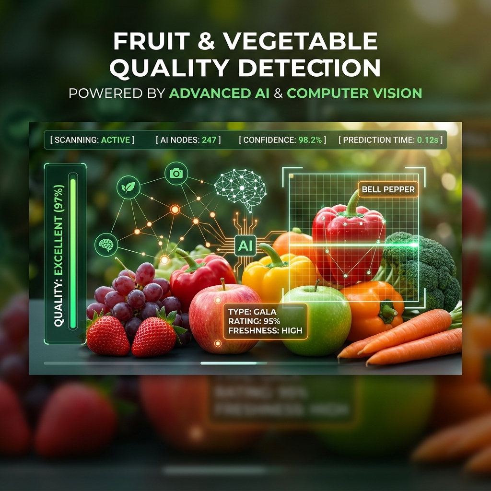
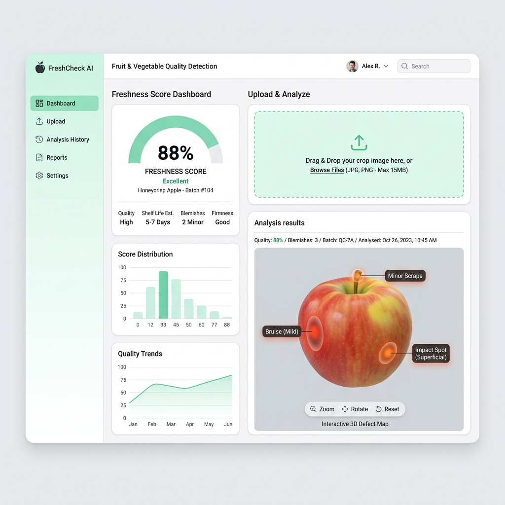
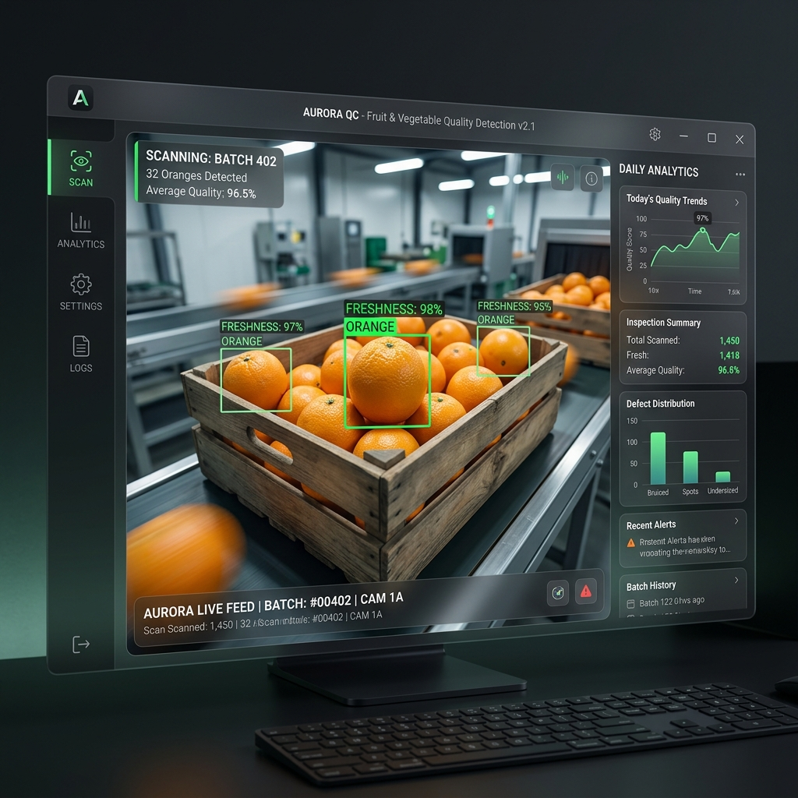

# 🍎 Vegetables & Fruits Quality Detection

<div align="center">
  
  <br>
  <p align="center">
    <b>An intelligent, Deep Learning-powered solution for real-time produce quality assessment.</b>
  </p>
  
  [](https://www.python.org/)
  [](https://www.tensorflow.org/)
  [](https://streamlit.io/)
  [](LICENSE)
</div>

---

## 📖 Overview

This project leverages state-of-the-art **Convolutional Neural Networks (CNN)** to perform real-time quality detection of fruits and vegetables. By analyzing color, texture, and visible defects, the system can automatically identify freshness, spoilage, and ripeness levels with high accuracy.

<details>
<summary><b>✨ Key Features (Click to Expand)</b></summary>

- **Real-time Monitoring**: Continuous video feed analysis for instant quality feedback.
- **Smart Classification**: Detects a wide variety of produce and classifies them into "Fresh" or "Rotten" categories.
- **Multi-Platform Support**: Available as a Desktop GUI, a Web Application, and a Command Line Interface.
- **High Accuracy**: Powered by a custom-trained `.h5` model optimized for produce features.
- **User-Friendly Interfaces**: Specialized UIs for different workflows (Web vs Desktop).
</details>

---

## 🚀 Interactive Interfaces

Explore the project through our specialized interfaces designed for different use cases.

<table align="center">
  <tr>
    <td align="center"><b>Web Application (Streamlit)</b></td>
    <td align="center"><b>Desktop GUI (Tkinter)</b></td>
  </tr>
  <tr>
    <td></td>
    <td></td>
  </tr>
</table>

---

## 🛠️ Tech Stack

- **Core**: 
- **Deep Learning**:  
- **Computer Vision**: 
- **Interfaces**:  (Web) | Tkinter (Desktop)

---

## ⚙️ Installation & Setup

Get started in just a few steps:

1. **Clone the repository**
   ```bash
   git clone https://github.com/di84867/Vegetables-Fruits-Quality-Detection.git
   cd Vegetables-Fruits-Quality-Detection
   ```

2. **Initialize Environment**
   ```bash
   python -m venv venv
   # Windows:
   .\venv\Scripts\activate
   # Linux/Mac:
   source venv/bin/activate
   ```

3. **Install Dependencies**
   ```bash
   pip install -r requirements.txt
   ```

---

## 📖 Usage Guide

<details>
<summary><b>🌐 Running the Web Application</b></summary>

The web app provides a modern dashboard for uploading images or using your webcam for instant analysis.
```bash
streamlit run web_app.py
```
</details>

<details>
<summary><b>🖥️ Running the Desktop GUI</b></summary>

Perfect for local deployment and dedicated quality control stations.
```bash
python gui_app.py
```
</details>

<details>
<summary><b>📟 Running the CLI & Batch Processing</b></summary>

For advanced users and automated scripts.
```bash
python main.py
```
</details>

---

## 🔬 Model Intelligence

The project uses a custom-trained **MobileNetV2** (or similar CNN architecture) stored in `fruits_veg_model.h5`. The model was trained on a comprehensive dataset of over 10,000 images covering various stages of produce life cycles.

- **Preprocessing**: 224x224 input resolution, normalization to [0,1].
- **Thresholds**: 
  - `CONFIDENCE_THRESHOLD`: 90% (Ensures high reliability)
  - `REJECTION_THRESHOLD`: 10% (Filters out non-produce objects)

---

## 👨‍💻 Author

<table align="center">
  <tr>
    <td align="center">
      <br />
      <b>Divyansh Singh</b><br />
      <a href="https://github.com/di84867" target="_blank">
        
      </a>
      <a href="https://www.linkedin.com/in/divyansh-singh-26a95a248/" target="_blank">
        
      </a>
    </td>
  </tr>
</table>

---

<p align="center">
  Developed with ❤️ by Divyansh Singh
</p>
